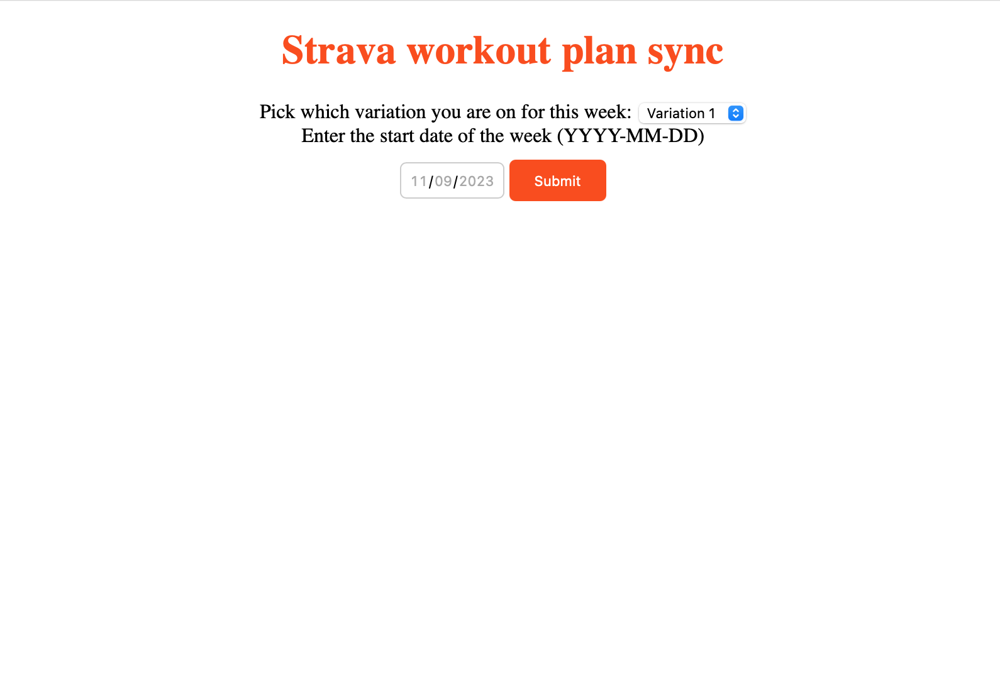
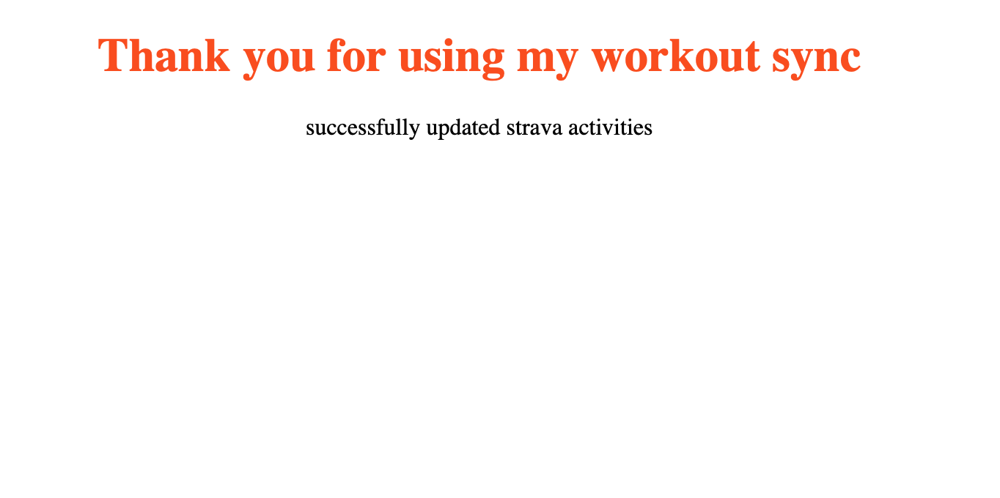

# Strava_workout_script
I started getting into body building routines and I track them in strava.
Some friends were curious about my routine, and I do like putting my notes about my routine in the app. 
The problem is that typing it all on my phone is alot for each workout.
Here is a script to write what work out day I was doing and all the movements I did . 

## How others can use this
this is more for people that work out 5 days a week but you can doctor my scripts for you as well.
what is needed
* a csv of all the workouts 
* strava application

### How to Run the application
#### python Libs needed 
```commandline
pip install flask
```
[Here ](https://flask.palletsprojects.com/en/3.0.x/)is the documentation for flask. I used flask to help handle the authentication of the script. 
```commandline
pip install stravalib
```
When looking at strava api documentation from  [this medium article](https://medium.com/analytics-vidhya/accessing-user-data-via-the-strava-api-using-stravalib-d5bee7fdde17) was a huge help on simple commands and how to go about
the strava api . The article is more on a manual approach of what I wanted to do which is where flask comes in. 
Along with the article I used [Strava's api](https://developers.strava.com/docs/reference/) documentation and the [github repo](https://github.com/stravalib/stravalib) to help learn more about the stravalib library.

## Running
for running one will have to make their own application through Strava's developer website as mentioned in the 
medium article. Then a user will have to create a secrets.py in the Secrets folder and put CLIENT_ID and CLIENT_SECRET in the file. 
```python
CLIENT_ID = '<string here> '
CLIENT_SECRET = '<string here>'
```
once this is in place the dev should just be able to run main.py with the command bellow
```commandline
python3 main.py
```

### Notes from the dev
This is a tool mostly to help writing descriptions better for each workout I did. Along with that though I wanted to show 
Strava I am super interested in their company and used their api to make a tool. I use strava alot and would love to
program for them one day. 

### Assumptions with the work out routine
I am doing a 5 day split in my work outs where it would go 
```commandline
upper 1
lower 1
upper 2
lower 2
upper 1
```
then the proceeding week will be 
```commandline
upper 2
lower 1
upper 1
lower 2
upper 2
```
the assumption is that I am following this routine and so with the sorted workouts I will check if its weight lifting then put in the changes if I am doing variation one or variation two. I will have this hard coded right now as I am short on time 
but once fully planned out this will allow user input to say which variation of the week and soon it will have different csvs to choose from.


### Possible bugs for strava devs
When calling the api to update my weight training I did get this error . Though I got this error I still was able to update my work outs

```commandline
Unable to set attribute visibility on entity <Activity id=<id> name=None>

```
Along with this weird line I also would not get a response payload back from the api call but maybe that is limited to 
the strava lib

# Navigation
the user will be directed to the user input page 

the user then can choose which week variation they are doing with the dropdown.
Along with this the user will then pick the start date of the week with this date picker and press 'Submit'

After this all the WeightTraining activities will be updated and the user will then see the response the app gives

